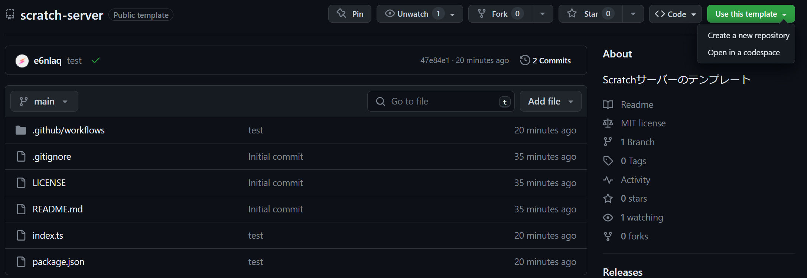

# Scratch Node.js Server Template

Scratchでサーバーを作る際に使える、テンプレートリポジトリです。

## 使い方

 Create a new repository'></img>

このリポジトリのStarとか書いてあるところに、**Use this template**と書かれたボタンがあるので、

そこから**Create a new repository**というボタンを押してください。

`image`フォルダは消して結構です

## サーバー(Actions)の立て方

GitHub Secretの`user`と`pass`に、それぞれサーバーに使うScratchのアカウント名とパスワードを設定

`.github/workflows/server.yml`の7~11行目のコメントを外せばok

後は時間で稼働します
